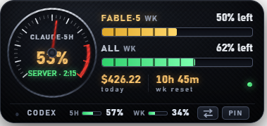
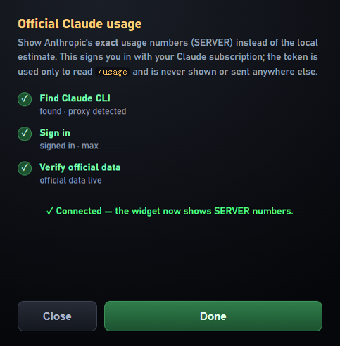

# Claude Usage Dashboard 🏎️

<p align="center">
  <a href="https://github.com/rxdage/claude-usage-dashboard/releases/latest"></a>
  <a href="https://github.com/rxdage/claude-usage-dashboard/releases"></a>
  
  
</p>

<p align="center">
  <a href="https://github.com/rxdage/claude-usage-dashboard/releases/latest">
    
  </a>
</p>

A floating "luxury-car instrument cluster" desktop widget that shows your
**Claude Code and OpenAI Codex** usage in real time — session (5-hour) and weekly
gauges. It auto-detects whichever you use (or both). **100% local by default**:
it reads your local transcripts, with no network and no credentials touched.
(An optional, off-by-default [official-usage mode](#advanced-official-claude-usage-opt-in)
can fetch Anthropic's authoritative numbers — see Advanced.)

**Works with both [Claude Code](https://claude.com/claude-code) and
[OpenAI Codex CLI](https://github.com/openai/codex).** It auto-detects whichever you
have (`~/.claude/projects` and/or `~/.codex/sessions`). **Use both?** The main
cluster **auto-follows whichever tool you used last** (30s hysteresis so it doesn't
flap), while a slim strip at the bottom always shows the other one's 5-hour and
weekly usage. Two buttons on the strip: **⇄ swap** switches the primary at any
time — in auto mode it's a temporary peek (auto-follow resumes after ~5 minutes
or on your next action; the mode is not changed), while pinned it re-pins to the
other side. **PIN** is an independent toggle: lit amber = locked to the current
primary, unlit = auto-follow. The tray **Data source** menu offers the same
three modes.

一个悬浮在桌面上的「豪车仪表盘」小组件,实时显示你的编码 agent 用量。**默认完全本地、不联网、不碰凭据**(有一个默认关闭的可选「官方用量」模式可拉取 Anthropic 官方数字,见 Advanced)。**同时支持 Claude Code 和 OpenAI Codex CLI**:主表盘**自动跟随你最近在用的那个**,底部细条常显另一个的 5 小时/周用量。细条右侧两个按钮:**⇄ 切换**随时对调主显且**不改变锁定状态**(auto 下是临时查看,约 5 分钟后恢复自动跟随);**PIN 锁定**独立开关(琥珀色点亮=锁定当前,熄灭=自动跟随)。



> **Windows-first.** Built and tested on Windows 11 with Electron. The core
> scanner is plain Node and should work cross-platform; the tray icon path and
> the auto-start snippet are Windows-specific.

### Claude Code vs Codex

| | Claude Code | Codex CLI |
|---|---|---|
| Data source | `~/.claude/projects/**.jsonl` | `~/.codex/sessions/**/rollout-*.jsonl` |
| Gauges | 5h session · Fable-5 weekly · all-model weekly | 5h session · weekly · cache-hit |
| Official %? | Not stored locally — **calibrate once** (see below) | **Read directly** from the logs' `rate_limits` — no calibration needed |

Codex writes the real 5-hour and weekly `used_percent` (and exact reset times) into
its session logs, so the Codex view is exact out of the box. The Claude view needs a
one-time calibration because Claude Code doesn't store those numbers locally.

## Download (no Node needed)

Grab the prebuilt Windows `.exe` from the
[**Releases**](https://github.com/rxdage/claude-usage-dashboard/releases) page:

- **`…-setup.exe`** — installer (adds a Start-menu entry).
- **`…-portable.exe`** — single-file, just double-click to run.

Builds are produced automatically by GitHub Actions on each tagged release.

## Run from source

Requires [Node.js](https://nodejs.org) 18+.

```bash
git clone https://github.com/rxdage/claude-usage-dashboard.git
cd claude-usage-dashboard
npm install
npm start
```

**Quick launch (Windows):** after `npm install`, double-click **`start-widget.cmd`**
— it starts the widget hidden (no console window) and detached. Point a Start-menu
or desktop shortcut at it for one-click launch.

To build the `.exe` yourself: `npm run dist` (output in `dist/`).

> **In mainland China**, if the Electron binary download stalls, set the mirror
> first: `set ELECTRON_MIRROR=https://npmmirror.com/mirrors/electron/` (PowerShell:
> `$env:ELECTRON_MIRROR="https://npmmirror.com/mirrors/electron/"`) then `npm install`.

- Frameless, transparent, always-on-top. Drag it anywhere — it **snaps to
  screen edges** and remembers its position.
- Hover the top-right for `–` (hide to tray) / `×` (quit). Tray icon right-click
  also quits. Relaunching just reveals the existing window (single instance).
- Rescans transcripts every 3 seconds (incremental).

## Layout (300 × 118)

| Area | Meaning |
|---|---|
| **SESSION** (left tachometer) | Current 5-hour rolling window usage %. Redline ≥80% turns the digital % red. Center shows %, tokens, and countdown to reset. Window algorithm matches ccusage. |
| **FABLE·5 WK** (top bar) | Fable-5 weekly usage. **Once calibrated** it shows "X% left" as a green→amber→red fuel bar; uncalibrated it shows "used · set limit" with an amber bar of Fable's share of the week. |
| **ALL WK** (middle bar) | All-model weekly usage, same behavior. |
| **Footer** | Today's cost, countdown to the **weekly reset** (Mon 09:00), green `●` activity lamp (lit within 90s of a request; turns red on a scan error). |

Set `"opacity": 0.9` in `config.json` to make the window translucent.

## Making the numbers match `/usage` — calibrate once

The widget can't read the official quota numbers (that needs an OAuth token, kept
in the OS credential store). So you calibrate once against `/usage`, and the bars
then show real "remaining". The weekly window is anchored to the same **Monday
09:00 reset** as Claude, so one calibration holds for the whole week.

**Easiest — the tray button (works for the .exe too):** right-click the tray icon
→ **Calibrate…**. A small window opens; run `/usage` in Claude Code and type the
percentages it shows (Fable weekly, All weekly, and/or 5-hour), then click
**Apply**. The bars update instantly. No command line, no file editing.

**From source, one command:** run `/usage`, then:

```bash
npm run cal -- <Fable weekly %> <All weekly %> [session %]
# e.g. /usage shows Fable 21%, all 17%, 5h 33%:
npm run cal -- 21 17 33
```

Either way it reads your current usage, back-solves the limits, writes
`config.json`, and the widget picks it up within ~3s (no restart).

### Why "cost-weighted" instead of raw token count

Usage is metered **cost-weighted** by default (`"metric": "cost"`), not raw tokens.
Reason: in practice ~96% of your tokens are **cache reads**, which cost only 0.1× of
input — the official `/usage` clearly doesn't count them 1:1, or a cache-heavy
session would blow through your quota instantly. Cost-weighting discounts cache
reads the same way pricing does, which lines up with `/usage`.

Cost is estimated at API list prices (cache write 1.25×/2×, cache read 0.1× input):
Fable $10/$50 · Opus 4.x $5/$25 · Sonnet $3/$15 · Haiku 4.5 $1/$5 per MTok. The "$"
here is a **weighting unit**, not what your subscription actually bills.

### `config.json` reference

`config.json` is created automatically (it stores window position too) and is
**git-ignored** — it holds your personal calibration.

- **Run from source:** it lives in the project folder next to `package.json`.
- **Prebuilt `.exe`:** it lives in your user data folder,
  `%APPDATA%\Claude Usage Dashboard\config.json`. Easiest way to change
  calibration is the tray **"Calibrate…"** button; the tray **"Open config
  folder"** item opens the file directly for manual edits. (`npm run cal` only
  applies to the from-source install.)

Keys:

```json
{
  "metric": "cost",
  "fableWeeklyLimit": 1596.84,
  "weeklyLimit": 3360.24,
  "sessionLimit": 191.48,
  "weeklyResetDay": 1,
  "weeklyResetHour": 9,
  "opacity": 1.0,
  "alerts": true,
  "alertWarnPct": 80,
  "alertCritPct": 95
}
```

- The three `*Limit` values are in the metric's unit (cost `$` by default). All
  optional — only the one you calibrate shows "remaining"; the rest show an
  informational "used" bar.
- `weeklyResetDay` (0=Sun…6=Sat) / `weeklyResetHour` anchor the weekly window;
  default Mon 09:00 to match `/usage`'s "Resets Mon 9:00 AM". Change if your plan
  resets at a different time.
- Set `"metric": "tokens"` to revert to raw-token counting (less accurate).
- **Usage alerts** — when any *real* limit (an official SERVER percentage, a
  Codex rate-limit window, or a limit you've calibrated) crosses a threshold,
  the panel breathes a soft edge glow: amber at `alertWarnPct` (default 80%),
  red at `alertCritPct` (default 95%). Hover the tray icon to see which limit
  and how high. It's a quiet in-widget tell-tale — no system popups. The
  uncalibrated auto session gauge never triggers it (it would cry wolf). Set
  `"alerts": false` to disable.
- **Start with Windows** — the installed (setup.exe) build registers itself to
  launch at login on first run. Toggle it from the tray menu ("Start with
  Windows") or set `"startAtLogin": false`. The portable exe defaults to off
  (the file may move around) but the same toggle works if you keep it in one
  place. Uninstalling removes the entry.

### Two known systematic gaps

1. **This machine only.** Weekly limits are account-wide, but the widget only
   scans this machine's `~/.claude/projects`. Usage from claude.ai or other
   devices is invisible → it can read low. (Same caveat as `/usage`'s
   "this machine only, excludes claude.ai".)
2. **Approximate weighting.** Cost-weighting is the best local approximation, not
   Anthropic's exact formula, so it can drift a few points when your workload mix
   changes a lot. Re-run `npm run cal` when it looks off.

## Advanced: official Claude usage (opt-in)

By default the Claude view is a **local estimate**, calibrated against `/usage`.
If you'd rather show Anthropic's **authoritative** numbers directly, you can opt
into official-usage mode. **This is off by default** because it changes the
privacy profile: it reads your logged-in Claude OAuth token and makes a network
request to Anthropic.

**Easiest — the setup wizard:** tray → **Set up official usage…**. It finds the
Claude CLI, injects your system proxy, opens a sign-in terminal (approve in your
browser — no commands to type), and flips to green **✓ Connected** automatically.



The tach's source tag then reads **`SERVER`** (green, glowing) for live official
data, `STALE` (amber) for cached, or `EST` (dim) when it falls back to local —
so you can always tell at a glance which numbers you're looking at.

The rest of this section is the manual path / reference.

**What it does / doesn't do**
- Reads your Claude OAuth token from (in order) the `CLAUDE_CODE_OAUTH_TOKEN`
  env var, Claude Code's `~/.claude/.credentials.json`, or — where the OS allows
  it — the Claude Desktop token cache.
- Sends that token **only** as a `Bearer` header to `GET /api/oauth/usage`
  (the same endpoint `/usage` uses). The token is **never displayed, logged, or
  written** by this widget.
- If it can't get a token or the request fails, it **silently falls back to the
  local estimate** — it never blocks or shows stale-as-fresh data.

**Turn it on** — add to `config.json`:

```json
{ "officialUsage": true }
```

**Getting a token that actually works:**

- **`claude setup-token` does NOT work** for this — its long-lived tokens lack
  the `user:profile` scope and the usage endpoint rejects them with 403
  (verified). The widget automatically skips such tokens.
- **What works: a one-time full login in the Claude Code CLI.** Run `claude` in
  a terminal, type `/login`, sign in with your Claude subscription. That writes
  `~/.claude/.credentials.json` with the right scopes, and the widget picks it
  up immediately. (If you only use the Claude *desktop* app, its bundled CLI
  lives under `%LOCALAPPDATA%\Packages\Claude_*\LocalCache\Roaming\Claude\claude-code\<version>\claude.exe`
  — run that once. Behind a proxy, `set HTTPS_PROXY=...` in the same terminal
  first.)
- The Claude **Desktop** token cache can't be decrypted by a separate app
  (OS app-bound encryption), so the widget can't reuse it.

**Auto-refresh:** the login writes both a short-lived access token (~8h) and a
longer-lived refresh token (~4 weeks). When the access token expires, the widget
uses the refresh token to get a new one and writes it back to
`~/.claude/.credentials.json` (atomically, preserving every other field — the
same file the CLI reads, so they stay in sync). So `SERVER` stays live without
you touching anything, as long as you log in via the CLI at least once every few
weeks (any CLI use also refreshes it). To keep refreshed tokens in memory only
and never write the file, set `"officialUsageWriteBack": false` in `config.json`.

If both the access token is expired *and* the refresh fails (e.g. the refresh
token itself expired, or no network), the widget silently falls back to `EST`.

**Check whether it works on your machine** without opening the window:

```bash
./node_modules/.bin/electron.cmd . --probe-usage
```

It prints the resolved status only (never the token): `SERVER` = live official,
`STALE` = cached official, `EST` = fell back to local (with the reason, e.g.
`claude-oauth-credentials-not-found`).

**In the widget**, the tach's sub-label shows which source is live: `SERVER` /
`STALE` / `EST`. Non-`SERVER` numbers are prefixed with `~`.

## Regenerating the icon

The tray/app icon is generated programmatically. Needs Python + Pillow
(`pip install pillow`):

```bash
python make_icon.py   # writes assets/icon-*.png and assets/icon.ico
```

## Auto-start on login (Windows, optional)

Run from the project directory:

```powershell
$ws = New-Object -ComObject WScript.Shell
$sc = $ws.CreateShortcut("$env:APPDATA\Microsoft\Windows\Start Menu\Programs\Startup\ClaudeUsageDashboard.lnk")
$sc.TargetPath  = "$env:ComSpec"
$sc.Arguments   = "/c cd /d `"$PWD`" && npm start"
$sc.WindowStyle = 7
$sc.Save()
```

## License

**PolyForm Noncommercial License 1.0.0** — see [LICENSE](LICENSE).

Personal use, research, and education are all explicitly permitted. **Commercial
use (any use intended for or directed toward commercial advantage or monetary
compensation) is not licensed.** If you want to use this project commercially,
contact the author to discuss terms.

> Note: releases published before this change (v1.0.0–v1.6.1) were distributed
> under the MIT License and remain under those terms for anyone who already has
> a copy — this change applies going forward.
